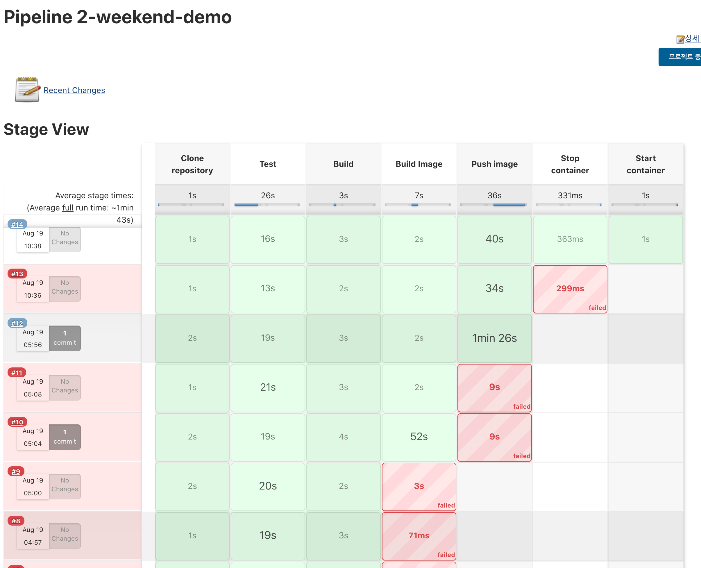

# 2장 도커 엔진 task


### 실습 목표

* Vagrant 가상 환경에서 Jenkins 를 설치, 구동한다.
* Jenkins pipeline 기능 (Jenkinsfile) 을 이용하여 Spring 어플리케이션을 배포한다.
* 배포 시에는 Dockerfile 을 이용하여 docker image 를 생성 한 뒤 image 기반의 컨테이너를 띄우는 방식으로 구성한다.


#### Vagrant 가상 환경에서 Jenkins 를 설치, 구동한다.

```shell
# -*- mode: ruby -*-
# vi: set ft=ruby :

Vagrant.configure("2") do |config|
    config.vm.network "private_network", ip: "192.168.1.2"
		config.vm.network "forwarded_port", guest: 9090, host: 9090
		config.vm.network "forwarded_port", guest: 9091, host: 9091
		config.vm.network "forwarded_port", guest: 9092, host: 9092
    config.vm.network "forwarded_port", guest: 22, host: 1234, id: "ssh"
    config.vm.provider "virtualbox" do |vb|
        vb.memory = 4096
        vb.cpus = 4
    end
  config.vm.box = "centos/7"
	config.vm.provision "shell", inline: <<-SHELL
		yum install net-tools -y
		yum install ansible -y
		yum install git -y
	SHELL
	config.vm.provision "ansible" do |ansible|
        ansible.verbose = "vv"
        ansible.playbook = "provisioning/playbook.yml"
    end
	config.vm.provision :docker,
		images: ["ubuntu:14.04"]
end

```

* centos7 기반의 linux 머신
* port
  * 9090: jenkins, 9091: spring boot application, 9092: mysql
* jenkins install, start 를 위해 ansible provision 단계를 추가
* docker 커맨드 사용을 위해 docker provision 단계를 추가

```shell
vagrant up
```

#### Jenkins pipeline 기능 (Jenkinsfile) 을 이용하여 Spring 어플리케이션을 배포한다.

1. Clone repository
2. Test
   1. ./gradlew test
3. Build
   1. ./gradlew clean assemble
   2. move jar
4. Build Image
   1. jar 파일 복사해오는 과정 포함
5. Push Image
6. stop container
7. start container


##### Jenkinsfile

```groovy
node {
    stage('Clone repository') {
        git 'https://github.com/HaJaeKwon/book-Getting-Started-with-Docker-Kubernetes.git'
    }

    dir('2장_도커_엔진_task') {
        stage('Test') {
            sh './gradlew test'
        }

        stage('Build') {
            sh './gradlew clean assemble'
            sh 'cp ./build/libs/demo.jar ./'
        }
    }

    stage('Build Image') {
        app = docker.build("hazxz/2-weekend", "./2장_도커_엔진_task")
    }

    stage('Push image') {
        docker.withRegistry('https://registry.hub.docker.com', 'docker-hub') {
            app.push("${env.BUILD_ID}")
            app.push("latest")
        }
    }

    stage('Stop container') {
        try {
            sh 'docker stop 2-weekend-demo; docker rm 2-weekend-demo'
        } catch (Exception e) {
            echo 'container is not running'
        }
    }

    stage('Start container') {
        sh 'docker run -d --name 2-weekend-demo -p 9091:9091 --restart=always hazxz/2-weekend:latest'
    }
}

```


##### Dockerfile

```groovy
FROM openjdk:8-jre-alpine

EXPOSE 9091

ARG JAR_FILE=./build/libs/demo.jar

ADD ${JAR_FILE} demo.jar

HEALTHCHECK --interval=5s \
            --timeout=5s \
            CMD curl -f http://127.0.0.1:9091/ping || exit 1

ENTRYPOINT ["java","-Djava.security.egd=file:/dev/./urandom","-jar","/demo.jar"]

```





